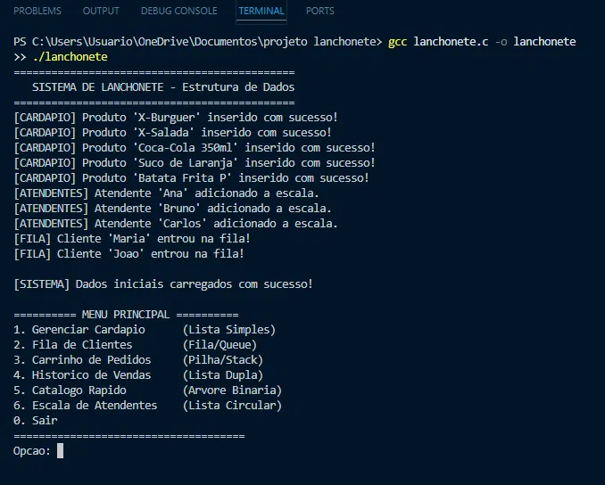

# 🍔 Sistema de Lanchonete — Estruturas de Dados em C

Projeto acadêmico desenvolvido para a disciplina de **Estrutura de Dados**, implementando um sistema de gerenciamento de lanchonete que aplica na prática seis estruturas de dados fundamentais em linguagem C.



---

## 📚 Estruturas de Dados Implementadas

| Estrutura | Aplicação no Sistema |
|---|---|
| Lista Simplesmente Encadeada | Cardápio de produtos |
| Lista Duplamente Encadeada | Histórico de vendas (navegação bidirecional) |
| Lista Circular | Escala rotativa de atendentes |
| Pilha (Stack) | Carrinho de pedidos com desfazer |
| Fila (Queue) | Fila de clientes |
| Árvore Binária de Busca | Catálogo com busca eficiente O(log n) |

---

## ⚙️ Como compilar e executar

Você precisa de um compilador C instalado (GCC recomendado).

```bash
# Compilar
gcc lanchonete.c -o lanchonete

# Executar
./lanchonete
```

No Windows com MinGW:
```bash
gcc lanchonete.c -o lanchonete.exe
lanchonete.exe
```

---

## 🖥️ Funcionalidades

- **Cardápio** — inserir, remover, buscar e listar produtos via lista encadeada
- **Fila de clientes** — entrada e atendimento em ordem de chegada (FIFO)
- **Carrinho de pedidos** — adicionar itens e desfazer o último pedido (LIFO/Stack)
- **Histórico de vendas** — visualizar do mais antigo ao mais recente e vice-versa
- **Catálogo rápido** — busca binária por código do produto na árvore BST
- **Escala de atendentes** — rodízio circular automático entre atendentes

---

## 📁 Estrutura do projeto

```
.
├── lanchonete.c               # Código-fonte principal
└── Relatorio_Estrutura_de_Dados.docx  # Relatório acadêmico do projeto
```

---

## 🧠 Conceitos aplicados

- Alocação dinâmica de memória com `malloc` e `free`
- Ponteiros e aritmética de ponteiros
- Recursão (inserção e remoção na árvore binária)
- Travessia in-order na árvore (produz saída em ordem crescente)
- Encadeamento circular com detecção de volta ao início

---

## 📝 Observações

- Os dados iniciais (produtos, atendentes e clientes) são carregados automaticamente ao iniciar o sistema
- Toda a entrada/saída é feita via terminal
- O projeto não utiliza bibliotecas externas além da biblioteca padrão C (`stdio.h`, `stdlib.h`, `string.h`)
